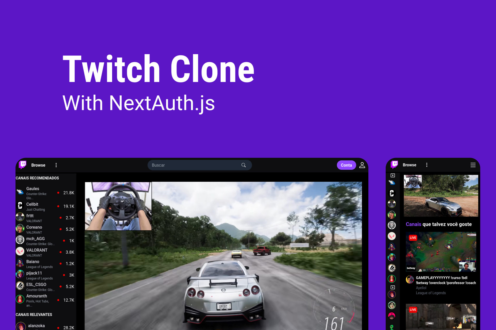

# Twitch Clone | With NextAuth.js

> Clone the Twitch interface using some Headless UI components. A login and logout system was implemented with NextAuth.js and its providers, using APIs and authentication services from Google and Github with the OAuth protocol to allow users to log in through third-party websites. Core of the project taught in the channel <strong>Code Commerce</strong>.
